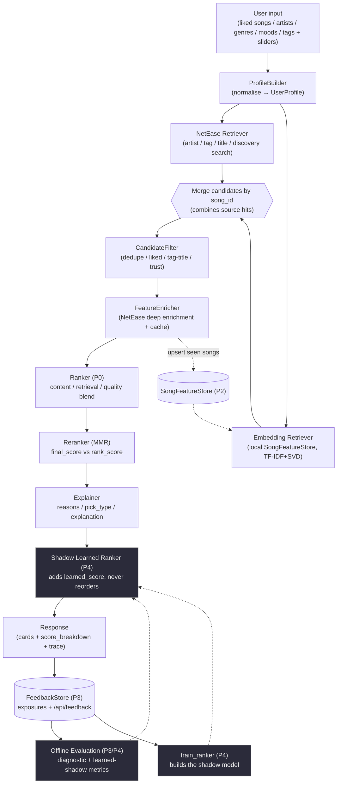

# SongRecDemo &mdash; Real-Song Music Recommender

A local-only web demo that recommends **real songs** &mdash; with title,
artist, album, cover art, and a NetEase Cloud Music link &mdash; from
user-friendly inputs (songs you like, artists you like, genres / moods
/ tags). The demo is split into two clearly separate layers and one
of them deliberately stays untouched.

```
┌───────────────────────────────────────────────────────────────────┐
│                      RESEARCH LAYER (untouched)                    │
│                                                                    │
│  src/personalization/RecommendationService                         │
│    - ALS (implicit MF), content (tag TF-IDF), popularity           │
│    - Trained on KGRec-music interaction data                       │
│    - Evaluated against KGRec test splits                           │
│    - Reachable only from /api/kgrec-recommend (developer debug)    │
└───────────────────────────────────────────────────────────────────┘
                                ▲
                                │ (debug route only)
                                │
┌───────────────────────────────┴──────────────────────────────────┐
│                       PRODUCT LAYER (this demo)                   │
│                                                                   │
│  SongRecDemo/netease_pipeline.py                                  │
│    - Profile builder       (liked songs + artists + tags)         │
│    - Candidate retrieval   (artist / tag / title / discovery)     │
│    - Score + MMR rerank    (KGRec-inspired logic, NetEase data)   │
│    - Explanations          (safe / exploratory / diverse picks)   │
│                                                                   │
│  SongRecDemo/app.py                                               │
│    - GET  /api/song-search   (live NetEase real-song search)      │
│    - POST /api/recommend     (real-song recommendations)          │
│    - GET  /api/health                                             │
│    - POST /api/kgrec-recommend  (research-layer debug)            │
└───────────────────────────────────────────────────────────────────┘
                                │
                                │ HTTP /search
                                ▼
                  Local NetEase Cloud Music API
                  (https://github.com/NeteaseCloudMusicApiEnhanced/api-enhanced)
```

> **Important:** the product layer is **not** trained on NetEase user
> behaviour data. It does not learn from user listens, plays, likes,
> playlists, or any private NetEase signal. It uses NetEase only as a
> public real-song catalog (via the `/search` endpoint) and ranks
> candidates with logic *inspired by* what the KGRec research layer
> demonstrates &mdash; profile building, content blending, novelty,
> diversity, and explanations.

---

## 0. Project evolution & demo guide (P0 &rarr; P4.5)

This product layer grew in deliberate, test-gated stages. Each stage is
additive: it never broke the previous frontend contract and never silently
changed the P0 ranking maths.

| Stage | Theme | What landed | Key modules |
| --- | --- | --- | --- |
| **P0** | Ranking semantics | Cleaned the scoring formula so `content_weight` genuinely blends content vs. retrieval; split **`final_score`** (standalone per-song relevance, shown to the user) from **`rank_score`** (the MMR objective that decides list position). | `pipeline/ranking.py`, `pipeline/scoring.py`, `pipeline/reranking.py` |
| **P1** | Modular pipeline | Refactored one monolithic recommender into independently testable stages (profile &rarr; retrieval &rarr; filter &rarr; enrich &rarr; rank &rarr; rerank &rarr; explain &rarr; trace). `netease_pipeline.py` became a thin backward-compatible facade. | `pipeline/` package, `pipeline/recommender.py` |
| **P2** | Embedding recall | Added a durable local `SongFeatureStore` + an **additive** TF-IDF/SVD embedding recall channel. Songs found by both NetEase search and embedding recall merge by `song_id`, naturally raising `multi_source_agreement`. Never replaces search, never touches P0 ranking. | `pipeline/feature_store.py`, `pipeline/embedding.py`, `pipeline/embedding_retrieval.py` |
| **P3** | Feedback logging + offline eval | Fire-and-forget SQLite `FeedbackStore` logging every exposure (request + each card) and any user feedback; `/api/feedback` endpoint; diagnostic offline evaluation harness over fixed seed profiles. | `pipeline/feedback.py`, `evaluation/` package |
| **P4** | Shadow learned ranker | A lightweight, explainable learned ranker (LogisticRegression) trained offline on the P3 feedback logs. Runs in **shadow mode** only: it emits a `learned_score` for analysis but **never reorders** the rule output. | `learning/` package |
| **P4.5** | Docs & demo readiness | This guide, the architecture diagram, fixed demo profiles, a sample evaluation report, and honest limitations / future work. | `README.md`, `demo/`, `evaluation/sample_eval_report.json` |

### Architecture diagram



### Demo commands

All commands run from the **project root** (`SeniorProj/`).

```powershell
# 1) Install the demo deps (flask + sklearn/joblib/numpy for P2/P4).
pip install -r SongRecDemo/requirements.txt

# 2) Start the app (product layer only; skips the heavy KGRec load).
python SongRecDemo/app.py --no-kgrec
#    -> open http://127.0.0.1:5173

# 3) Run the hermetic smoke tests (no network; 47 checks across P0-P4).
python SongRecDemo/smoke_test.py

# 4) Run the offline evaluation harness (deterministic, no network).
python -m SongRecDemo.evaluation.run_eval --offline --k 10 --out report.json

# 5) Train the shadow learned ranker from the feedback logs.
#    Fail-soft: prints a reason and exits 0 if there isn't enough data yet.
python -m SongRecDemo.learning.train_ranker
#    -> writes data/learned_ranker.joblib + data/learned_ranker_schema.json

# 6) Shadow mode is ON by default. Once a model exists, every /api/recommend
#    response carries learned_score per card and learned_ranker_loaded=true in
#    the trace. To toggle it explicitly:
$env:LEARNED_RANKER_SHADOW_MODE = "0"   # off
$env:LEARNED_RANKER_SHADOW_MODE = "1"   # on (default)
```

> Shadow mode is observe-only by design. `LEARNED_RANKER_ENABLED` exists for a
> future controlled rollout but in this version the learned score **never**
> drives the order.

### Demo scenarios

Three fixed, ready-to-POST profiles live in [`demo/`](demo/) with a guide to
exactly which `trace` and `score_breakdown` fields to watch:

- [`demo/content_heavy.json`](demo/content_heavy.json) &mdash; high
  `content_weight`; watch `content_score`, `artist_match`, small `novelty_bonus`,
  mostly `safe` picks.
- [`demo/discovery_high_novelty.json`](demo/discovery_high_novelty.json) &mdash;
  high `novelty`/`diversity`; watch `novelty_score`, `relevance_gate`, more
  `exploratory`/`diverse` picks.
- [`demo/embedding_recall.json`](demo/embedding_recall.json) &mdash; taste-only
  profile; watch `trace.num_embedding_candidates`, `trace.embedding_index_ready`,
  and `"embedding"` in `items[*].source_types`.

See [`demo/README.md`](demo/README.md) for the per-scenario observation points.

### Offline evaluation report sample

[`evaluation/sample_eval_report.json`](evaluation/sample_eval_report.json) is a
saved, representative run of the harness. It shows the full diagnostic metric
shape per profile plus the aggregate:

- `coverage` (unique artists / albums / source types)
- `diversity` (mean pairwise dissimilarity)
- `novelty` (mean `novelty_score`, mean inverse popularity)
- `source_mix` (share of each retrieval channel)
- `embedding_share` (fraction of cards from the local embedding channel)
- `duplicate_rate` (artist / title / album repetition)
- `latency_ms`
- `learned_shadow` (when a shadow model is attached): `learned_score_distribution`,
  `rank_correlation_between_rule_and_learned`,
  `top_k_overlap_between_rule_and_learned`, and `cases_where_model_disagrees`.

It is **diagnostic, not accuracy**: there are no human relevance labels yet, so
the harness never reports Precision / Recall / NDCG. The `learned_shadow` block
appears only when a model produced `learned_score`s; otherwise it is cleanly
skipped.

### System limitations (honest)

- **No real large-scale user-item matrix.** The product layer has no NetEase
  listen/like/skip history. `multi_source_agreement` is a *retrieval-consensus*
  signal, **not** trained collaborative filtering.
- **The learned ranker is shadow-only.** It computes `learned_score` for
  analysis and does not control the live ordering in this version.
- **Feedback labels are weak supervision.** Labels are derived by rule from a
  few explicit UI events (like / click / impression-only / dislike), not from
  complete, real listening behaviour. Impression-only rows are low-weight weak
  negatives, not confirmed dislikes.
- **Embedding recall depends on a local catalogue.** The store grows on every
  run, so early on (small catalogue) the embedding channel contributes little
  or nothing; it gets more useful as more songs are seen.
- **NetEase `/search` is still the primary real-song source.** When it is
  unreachable and a query is uncached, that query returns nothing rather than
  inventing songs.

### Future work

- Collect more real user feedback through `/api/feedback` to grow the training
  set beyond weak, sparse labels.
- Add a `manual_labels.json` of human relevance judgements to unlock honest
  accuracy metrics (Precision@K / NDCG@K / MRR) alongside the diagnostics.
- Graduate the learned ranker from shadow mode to a **controlled, blended**
  ranking (e.g. `final = (1 - alpha) * rule + alpha * learned`) with `alpha`
  ramped up carefully and A/B-guarded.
- Replace the local TF-IDF/SVD embedder with sentence-transformers embeddings
  and a FAISS index for larger, higher-quality recall.
- If enough genuine interaction data accumulates, explore a Two-Tower retrieval
  model trained on real user-item signals.

---

## 1. What this demo does (and doesn't) change

The following research-layer artefacts are completely untouched:

- `src/recommenders/` &mdash; popularity, content-based, ALS.
- `src/personalization/` &mdash; engine, profile builder, explainer,
  enrichment Protocol, NetEase enricher (used as a side-channel by the
  research-layer evaluator only).
- `src/data/` &mdash; preprocessing, splits, artefact loader.
- `src/evaluation/` and the `run_*_eval.py` scripts.
- `artifacts/splits/`, `artifacts/models/als_state.pkl`,
  `artifacts/results/`, `artifacts/sample_request.json`,
  `artifacts/sample_response.json`.
- `config.py` &mdash; pipeline + NetEase configuration.
- All saved KGRec validation / evaluation metrics.

The demo:

- **Adds** `SongRecDemo/netease_pipeline.py` &mdash; the new product-layer
  pipeline.
- **Rewrites** `SongRecDemo/app.py`, `SongRecDemo/static/index.html`, and
  `SongRecDemo/static/app.js` to expose the new pipeline as the
  primary user-facing flow, and exposes the KGRec model only behind
  an Advanced (developer) panel.
- **Reuses** the existing on-disk NetEase SQLite cache
  (`artifacts/netease_cache.sqlite`) so repeated calls are fast and
  offline-friendly.

---

## 2. Folder layout

```
SongRecDemo/
├─ app.py                   Flask backend (search / recommend / health / kgrec-debug)
├─ netease_pipeline.py      Product-layer pipeline + FakeNeteaseClient
├─ catalog.py               (legacy helper; unused by the new flow but kept on disk)
├─ smoke_test.py            Hermetic smoke test (no network)
├─ requirements.txt         Demo-only dependency: flask>=3.0
└─ static/
   ├─ index.html            Real-song search + picks + sliders + results
   ├─ styles.css            Calm dark UI
   └─ app.js                Real-song flow + KGRec debug button
```

The UI binds to **127.0.0.1 only** (local-only on purpose).

---

## 3. Prerequisites

You only need a **local NetEase Cloud Music API service** running for
the product layer to do anything useful. Nothing else is required for
the main user flow.

This repo ships a one-shot helper that clones the upstream service
into `vendor/api-enhanced/` (gitignored), installs its dependencies
through the npmmirror.com registry (much faster from China), and
starts the Node.js app on `http://localhost:3000`:

```powershell
scripts\start_netease_api.bat
```

Leave that terminal window open while you're using the demo. To stop
the NetEase service, close the window or hit `Ctrl+C` in it.

If you'd rather drive the upstream service by hand, the equivalent
commands are:

```powershell
# One-off:
git clone https://github.com/NeteaseCloudMusicApiEnhanced/api-enhanced vendor\api-enhanced
cd vendor\api-enhanced
npm install --omit=dev --ignore-scripts ^
    --registry=https://registry.npmmirror.com --no-audit --no-fund

# Every run:
node app.js                  # listens on localhost:3000 by default
```

Quick sanity check that the API is up:

```powershell
curl "http://localhost:3000/search?keywords=kanye&type=1&limit=1"
```

You should see a JSON blob with `result.songs[0].name`.

The Python demo speaks to the service via `config.NETEASE_API_BASE_URL`
(default `http://localhost:3000`). `/api/health` re-probes the URL on
every request, so you can start/stop the NetEase service without
restarting the Python demo &mdash; the green/amber dot updates in the
browser within seconds.

If you also want the **KGRec research-layer debug route** to work,
you need the trained ALS state on disk. Skip this section entirely if
you only care about the real-song flow.

```powershell
pip install -r requirements.txt
python run_preprocessing.py            # parquet splits + TF-IDF
python run_train_personalized.py       # writes artifacts/models/als_state.pkl
```

---

## 4. Install the demo dependency

```powershell
pip install -r SongRecDemo/requirements.txt
```

This adds **only** `flask>=3.0`.

---

## 5. Run the server

From the project root:

```powershell
python SongRecDemo/app.py
```

Default bind: `http://127.0.0.1:5173` (local-only). Open that URL in
your browser. The status pill in the top-right shows:

- **green** &mdash; product layer up, NetEase reachable.
- **amber** &mdash; product layer up, NetEase offline (search / recommend
  fall back to the on-disk cache; uncached queries return 503 until
  NetEase is reachable again).
- **red** &mdash; backend itself is unreachable.

### CLI flags

| Flag                        | Default                                   | Purpose                                                            |
| --------------------------- | ----------------------------------------- | ------------------------------------------------------------------ |
| `--host`                    | `127.0.0.1`                               | Bind host. Local-only by default.                                  |
| `--port`                    | `5173`                                    | Bind port.                                                         |
| `--netease-base-url URL`    | `http://localhost:3000`                   | Override the NetEase API URL.                                      |
| `--no-kgrec`                | off                                       | Skip the heavy research-layer load. `/api/kgrec-recommend` -> 503. |
| `--debug`                   | off                                       | Flask debug mode.                                                  |

`--no-kgrec` is convenient for fast iteration on the product layer
when you don't care about the debug route. The KGRec service loads
in a background thread on startup so the homepage is responsive even
when the artefacts are large.

---

## 6. Use the UI

The homepage is organized as a real music recommendation flow rather
than a model-testing page.

1. **Choose songs you like** - search by song title, artist, or both.
   The UI calls `GET /api/song-search?q=...` and renders NetEase song
   cards with cover art, title, artist, album, duration when available,
   and an **Add as liked song** button. Selected songs appear in
   **Songs I like** and can be removed before submitting.
2. **Describe your taste** - add comma-separated favorite artists,
   genres, moods, and tags. Example inputs include `Radiohead, Adele,
   Jay Chou`, `indie rock, R&B, Mandopop`, `sad, energetic, chill`, and
   `acoustic, piano, alternative`.
3. **Tune the recommendation style** - use the sliders with product
   labels:
   `Stay close to my taste` -> backend `content_weight`;
   `Discovery level` -> backend `novelty`;
   `List variety` -> backend `diversity`;
   `Number of songs` -> backend `k`.
4. **Use presets when presenting** - **Safe Mix** keeps results close
   to the profile, **Balanced** uses medium similarity/discovery/variety,
   and **Discovery** pushes novelty and variety higher.
5. **Get recommendations** - the frontend sends `POST /api/recommend`
   with NetEase-shaped `liked_songs` plus artists, genres, moods, tags,
   sliders, and `k`. Recommendation cards lead with real song metadata,
   then show the explanation, reason chips, NetEase link, and a
   collapsible **Why this song?** score view.

Pick-type badges:

| Badge | Meaning |
| --- | --- |
| `safe` | Close to the selected songs, artists, genres, or moods. |
| `exploratory` | A more surprising pick that leans into discovery. |
| `diverse` | Promoted to keep the list from getting too narrow. |
| `balanced` | A middle-ground pick when no single signal dominates. |

The **Try example** area fills the form with three demo-ready profiles:
Safe English alt-rock, Chinese pop discovery, and broader electronic /
indie-pop discovery. The examples also preload a useful search query;
selecting one or two songs before submitting makes the result list
more specific.

### Technical details

Main cards do not show KGRec item IDs, raw JSON, route names, or raw
score keys. Open **Why this song?** on a card for readable score labels
such as Taste match, Retrieval confidence, Artist affinity, Novelty,
and Diversity promotion.

The results panel also includes an **Advanced / technical details**
toggle after recommendations are generated. It contains raw
`score_breakdown`, source routes, NetEase song IDs, `model_info`,
`candidate_summary`, and the KGRec research-mode route reference for
debugging.

`POST /api/kgrec-recommend` remains a developer-only research route for
raw KGRec item IDs. It is not part of the main user flow. Running the
server with `--no-kgrec` disables that route entirely.

---

## 7. JSON contracts

### `GET /api/song-search?q=...&limit=N`

Real-song search via NetEase, with on-disk cache hit-through.

```jsonc
{
  "ok": true,
  "query": "bon iver",
  "items": [
    {
      "netease_song_id": 12345,
      "title": "Holocene",
      "artist": "Bon Iver",
      "artists": ["Bon Iver"],
      "album": "Bon Iver, Bon Iver",
      "cover_url": "https://...",
      "netease_url": "https://music.163.com/#/song?id=12345",
      "duration_ms": 337000
    }
  ]
}
```

If NetEase is unreachable and the query isn't cached, returns 503
with a clear error message and an empty `items` list.

### `POST /api/recommend`

Real-song recommendations. The whole request is **NetEase-shaped**:

```jsonc
{
  "liked_songs": [
    {
      "netease_song_id": 12345,
      "title": "Holocene",
      "artist": "Bon Iver",
      "artists": ["Bon Iver"],
      "album": "Bon Iver, Bon Iver",
      "cover_url": "https://..."
    }
  ],
  "liked_artists": ["Phoebe Bridgers"],
  "genres":        ["indie folk"],
  "moods":         ["mellow"],
  "tags":          [],
  "content_weight": 0.50,
  "novelty":        0.30,
  "diversity":      0.30,
  "k":              10
}
```

Response:

```jsonc
{
  "ok": true,
  "data": {
    "request_id": "....",
    "items": [
      {
        "rank": 1,
        "netease_song_id": 22345,
        "title": "Motion Sickness",
        "artist": "Phoebe Bridgers",
        "artists": ["Phoebe Bridgers"],
        "album": "Stranger in the Alps",
        "cover_url": "https://...",
        "netease_url": "https://music.163.com/#/song?id=22345",
        "score": 0.812,
        "score_breakdown": {
          "final": 0.812,
          "final_score": 0.812,
          "base_relevance": 0.690,
          "content": 0.560,
          "content_score": 0.560,
          "content_text_similarity": 0.430,
          "artist_match": 1.000,
          "tag_match": 0.500,
          "title_match": 0.000,
          "retrieval": 0.880,
          "retrieval_confidence_score": 0.880,
          "multi_source": 0.450,
          "collaborative_proxy_score": 0.450,
          "artist_affinity_score": 1.000,
          "popularity_score": 0.660,
          "artist_authority_score": 0.540,
          "playable_score": 1.000,
          "audio_quality_score": 0.800,
          "metadata_quality_score": 1.000,
          "trust_score": 0.700,
          "novelty_score": 0.220,
          "novelty_bonus": 0.066,
          "novelty_term": 0.220
        },
        "explanation": "This is a close match because it has strong relevance support from your artists, content profile, or high-confidence retrieval paths.",
        "reasons": [
          "Same artist as someone you like: Phoebe Bridgers",
          "Matches your tags: indie folk, mellow",
          "Found through multiple preference paths: artist, genre"
        ],
        "matched_tags": ["indie folk", "mellow"],
        "sources": ["artist:Phoebe Bridgers", "tag:indie folk"],
        "pick_type": "safe"
      }
    ],
    "control":           { "content_weight": 0.5, "novelty": 0.3, "diversity": 0.3, "k": 10 },
    "candidate_summary": {
      "retrieved_total": 58,
      "after_dedup": 17,
      "filtered_liked": 1,
      "filtered_same_title": 3,
      "filtered_tag_title": 1,
      "filtered_duplicate_version": 0,
      "filtered_missing_metadata": 0,
      "enriched_count": 12,
      "filtered_low_trust": 0,
      "filtered_unplayable": 0,
      "final_candidate_count": 12
    },
    "profile":           { "liked_song_ids": [12345], "liked_artists": ["Phoebe Bridgers"], "tags": ["indie folk", "mellow"], ... },
    "model_info": {
      "name": "NetEase-Pipeline-v1",
      "model_type": "real_song_hybrid_retrieval_ranking",
      "uses_netease_api": true,
      "trained_collaborative_filtering": false,
      "collaborative_proxy_used": true,
      "candidate_enrichment_used": true,
      "quality_thresholds": {
        "soft_min_comment_count": 10,
        "soft_min_artist_follow_count": 77
      },
      "research_layer": "KGRec ALS/content/popularity evaluation remains separate",
      "source": "NetEase /search"
    },
    "fallback_used": null
  }
}
```

The `data.items` payload **never** carries a KGRec `item_id`. The
smoke test asserts this.

### `GET /api/health`

```jsonc
{
  "ok": true,
  "product_layer":  {
    "name": "NetEase-Pipeline-v1",
    "netease_alive": true,
    "netease_base":  "http://localhost:3000"
  },
  "research_layer": {
    "enabled":   true,
    "ready":     true,
    "attempted": true,
    "error":     null,
    "model":            "ALS-Personalized-v1",
    "catalogue_size":   8640,
    "vocabulary_size":  8477
  }
}
```

### `POST /api/kgrec-recommend` (developer debug)

Same input shape as the old KGRec `/api/recommend` (`seed_ids`,
`favorite_ids`, `tags`, sliders, `k`), wraps `RecommendationService`
unchanged, returns the standard `RecommendationResponse` plus a
`warning` string. 503 when the research layer is disabled or still
loading.

---

## 8. The recommendation pipeline (logic notes)

The KGRec code is the research/evaluation layer. It contains the
popularity baseline, ALS collaborative filtering, content-based tag
recommender, shared evaluation protocol, and saved validation results.
The Real Song Mode does not change those artifacts.

The Real Song Mode is the NetEase product-demo layer. It uses NetEase
as a real-song retrieval source, then ranks the candidate pool with a
small, explainable hybrid scorer:

1. **Profile** &mdash; liked songs, liked artists, genres, moods, and
   tags are normalized into a profile text while preserving original
   title/artist/album metadata for display. The profile keeps separate
   `preferred_genres`, `preferred_moods`, `preferred_tags`, seed artist
   weights, selected song text, liked title keys, and query-intent
   terms.
2. **Retrieve** &mdash; NetEase `/search` is called through multiple
   routes:
   - artist,
   - artist + genre/mood,
   - genre/tag/mood,
   - genre + mood and tag combinations,
   - seed song title + artist,
   - artist + album keyword,
   - low-reliability title-only,
   - discovery queries built from top profile terms.
   Each source records its name, source type, query text, reliability
   weight, and original NetEase result position.
3. **Filter** &mdash; the demo removes liked/excluded tracks, same-title
   covers or variants, literal tag-title shortcut matches such as a
   song named `alternative rock`, exact duplicate title+artist rows,
   avoidable live/remix/acoustic/version duplicates, and candidates
   missing title or artist when alternatives exist.
4. **Enrich top candidates** &mdash; after a lightweight first score,
   the backend enriches only the strongest candidates (currently top
   30) with optional NetEase evidence:
   - comment totals / hot comment count,
   - dynamic popularity signals such as red-count-like fields when
     available,
   - artist follower / authority fields when the endpoint exposes them,
   - playable URL status and audio quality,
   - lyric excerpts and similar-song IDs when available.
   These calls are cached under a `songrec_demo:enrich:*` namespace.
   If an endpoint is empty, cookie-gated, region-limited, or slow, the
   pipeline keeps working and treats the missing feature as unknown
   rather than as a failed recommendation.
5. **Trust filter** &mdash; enriched candidates can be filtered when they
   are simultaneously weak on public evidence and weak on route
   evidence. The current soft thresholds are `comment_count < 10` and
   `artist_follow_count < 77`, combined with low collaborative proxy
   and low retrieval confidence. Known-unplayable songs are filtered.
6. **Score** &mdash; each candidate gets explicit, inspectable signals:
   - `content_score`, backed by lightweight local TF-IDF cosine
     similarity plus artist/tag/title matches.
   - `retrieval_confidence_score`, based on source reliability, NetEase
     rank position, and metadata completeness.
   - `collaborative_proxy_score`, a multi-source co-occurrence signal:
     candidates found by several independent preference routes are more
     trustworthy. This is not trained collaborative filtering.
   - `artist_affinity_score`, from liked/seed artist weights.
   - `popularity_score`, from comments, hot comments, and red-count-like
     public signals when available.
   - `artist_authority_score`, from artist follower/fan-count-like
     fields when available.
   - `playable_score` and `audio_quality_score`, so the demo avoids
     recommending songs known to be unavailable.
   - `trust_score`, a compact diagnostic that combines public evidence,
     route evidence, playability, and metadata completeness.
   - `metadata_quality_score`, favoring complete real-song cards.
   - `novelty_score`, for unfamiliar but still relevant candidates.

   The final score is:

   ```
   content_score =
       0.35 * content_text_similarity
     + 0.30 * artist_match
     + 0.25 * tag_match
     + 0.10 * title_match

   base_relevance =
       0.25 * content_score
     + 0.18 * collaborative_proxy_score
     + 0.15 * retrieval_confidence_score
     + 0.12 * artist_affinity_score
     + 0.10 * popularity_score
     + 0.10 * artist_authority_score
     + 0.05 * playable_score
     + 0.05 * metadata_quality_score

   relevance_gate = min(1.0, base_relevance / 0.55)
   novelty_bonus  = novelty_slider * novelty_score * relevance_gate
   final_score    = clip(base_relevance + novelty_bonus)
   ```

   The novelty gate matters: a random result should not win just
   because it is unfamiliar.
7. **MMR rerank** &mdash; greedy diversification with
   `lambda = diversity`. Similarity blends same artist, tag/genre/mood
   overlap, album overlap, and TF-IDF text-vector similarity. The
   per-artist cap is `1` for `k <= 5`, `2` for `6 <= k <= 10`, and `3`
   for larger lists.
8. **Explain** &mdash; each card gets a user-facing sentence, structured
   reasons, matched tags, score breakdown, and a `pick_type` of `safe`,
   `exploratory`, `diverse`, or `balanced`.

True collaborative filtering over NetEase would require real
user-song behavior data such as listens, likes, skips, saves, or
playlist co-occurrence. This demo does not have that data and does not
claim to train a NetEase CF model. Its `collaborative_proxy_score` is
only a multi-source retrieval co-occurrence signal inspired by the
intuition behind collaborative filtering.

Caching: every NetEase `/search` call is cached on disk in
`artifacts/netease_cache.sqlite` (the same cache the research-layer
enricher uses; the keys are namespaced so the two callers never
collide). Repeated demo runs with the same artists / tags are
near-instant.

---

## 9. Smoke test

```powershell
python SongRecDemo/smoke_test.py
```

The smoke test is **fully hermetic**: it injects a
`FakeNeteaseClient` (in `netease_pipeline.py`) with canned responses
for the queries it exercises, and constructs the Flask app with
`load_kgrec=False` so it does not depend on trained artefacts being
present.

It now runs **47 checks** spanning every stage: the original P0/P1 API +
ranking checks (1&ndash;16), the P2 feature-store + embedding-recall checks
(17&ndash;27), the P3 feedback-logging + offline-eval checks (28&ndash;37),
and the P4 shadow-learned-ranker checks (38&ndash;47: dataset builder, weak
label rules, fail-soft training, `LearnedRanker` fit/predict/save/load,
shadow mode with and without a model, the invariant that `learned_score`
never changes the rule order, eval skipping/reporting learned metrics, and
`FeedbackStore` health). The original P0/P1 checks are:

1. `GET /api/health` &mdash; product layer up, NetEase reported alive.
2. `GET /api/song-search?q=...` &mdash; returns NetEase-shaped real-song
   hits with `netease_song_id`, `title`, `artist`, `album`,
   `cover_url`, `netease_url`. Empty query -> 200 + empty list.
3. `POST /api/recommend` (real-song flow) &mdash; selecting real songs
   and tags returns ranked cards.
4. Recommendation cards include title, artist, album, NetEase link,
   explanation, score breakdown, matched tags, and a `pick_type`
   label.
5. Score breakdown includes `content_score`,
   `content_text_similarity`, `collaborative_proxy_score`,
   `retrieval_confidence_score`, `artist_affinity_score`,
   `popularity_score`, `artist_authority_score`, `playable_score`,
   `audio_quality_score`, `metadata_quality_score`, `trust_score`,
   `novelty_score`, `novelty_bonus`, and `final_score`.
6. Low-trust title-only candidates and known-unplayable candidates are
   filtered using cached enrichment evidence.
7. Novelty is gated by relevance, so irrelevant candidates do not win
   just because they are unfamiliar.
8. MMR respects the small-`k` per-artist cap when alternatives exist.
9. Same-title variants and literal tag-title shortcut matches are
   filtered.
10. Explanations exist and match the card's `pick_type`.
11. `model_info` states that Real Song Mode uses a collaborative proxy,
   not trained NetEase collaborative filtering.
12. The main `/api/recommend` response **never** carries a KGRec
   `item_id` field (recursive walk asserts).
13. Empty input -> response with `fallback_used = "no_input"`,
   200 OK.
14. Bad body -> 400 / wrong content type -> 415.
15. `/api/kgrec-recommend` answers 503 when the research layer is
   disabled (`--no-kgrec`).

Exit code is `0` on full pass and `1` otherwise.

---

## 10. Why the KGRec model isn't the user-facing recommender

The KGRec ALS model has one row per KGRec item in its `item_factors`
matrix. It can only score those 8&nbsp;640 KGRec items, and KGRec
items don't all map to a real-song NetEase match (the catalog of
matched items is sparse and depends on what the offline NetEase
enrichment was able to find). So:

- If we made the KGRec model the user-facing recommender, the user
  would pick songs (or KGRec IDs) and then receive KGRec IDs back.
  Many of those would have no real-song metadata and would render as
  "internal-only" cards &mdash; a description blurb instead of a
  song.
- If we filtered KGRec output to only matched items, the candidate
  pool collapses and many recommendations become repetitive.

Instead, the demo uses the KGRec model where it is honest: as the
*research artifact* that demonstrates the personalization logic, and
exposes that model only via a developer-facing debug route. The
user-facing experience is built on top of NetEase search directly,
with the same shape of logic the research demonstrates &mdash;
profile, content blend, novelty, diversity, explanation &mdash; but
operating over real-song retrieval.
